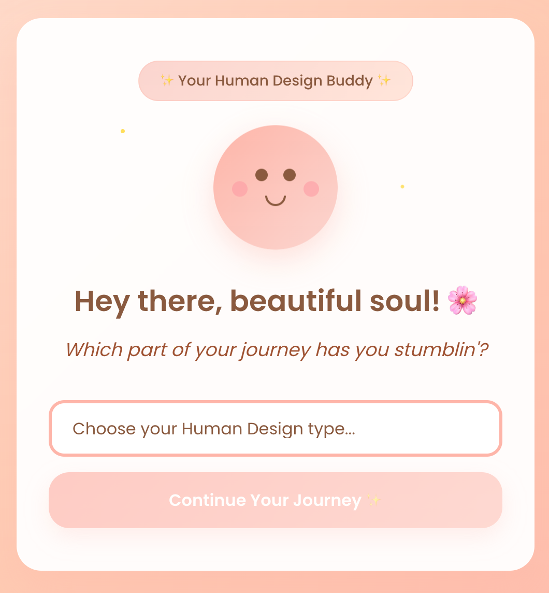
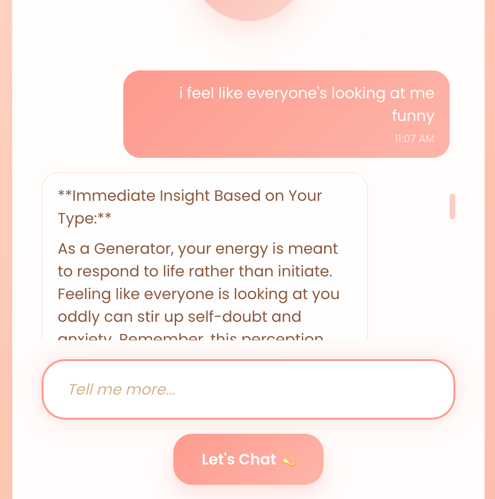

# 🤖💫 Human Design AI Guide 💬🌈  🌙🔮

A beautiful, interactive AI chatbot designed to help users with their daily struggles by giving specific & sound advice based on their human design type. 

<p align="center">
  
</p>
<p align="center">
  
</p>

## ✨ Features

- **Beautiful UI** – Gradient backgrounds, animated bot avatar, and smooth transitions  
- **Interactive Chat** – Real-time messaging with typing indicators  
- **Responsive Design** – Optimized for desktop and mobile devices  
- **Scalable Architecture** – Clean, modular React components for easy expansion  

## 🏃‍♂️ Quick Start Guide

### Prerequisites
- Node.js (v14 or higher)
- npm or yarn
- Cursor IDE (recommended)

### Installation & Setup

1. **Clone the repository**
   ```bash
   git clone https://github.com/loveangelagu/human-design.git
   cd human-design
   ```

2. **Open in Cursor IDE**
   - Launch Cursor
   - Open the cloned repository folder
   - Cursor will automatically detect the React project

3. **Install dependencies**
   ```bash
   npm install
   ```

4. **Run the development server**
   ```bash
   npm start
   ```
   *Or simply tell Cursor: "Run the code" and it will execute the above commands automatically*

5. **View the website**
   - Open your browser and go to `http://localhost:3000`

### Using Cursor AI
This project was built using Cursor AI for rapid development. To continue development:
- Ask Cursor to run the code: it will handle npm install and npm start
- Make changes and Cursor will provide real-time suggestions
- Use Cursor's AI assistance for adding new features or modifications

## 🛠 Development Process
- Frontend: Built with React (functional components + hooks)
- Styling: Tailwind CSS for utility-first, responsive design
- Chat Engine: Integrated with OpenAI’s chat.completions API
- State Management: Lightweight with useState and localStorage for user type persistence
- Architecture: Modular and extensible for future features (e.g. session memory, multi-authority support)

## 🦄 Future Enhancements
- Persistent user sessions with backend database
- More detailed Human Design data (authorities, centers, profiles)
- Advanced conversation memory for deeper coaching

## 🤝 Let's Connect

I’m always open to feedback, collaborations, or new opportunities. Drop me a message or just say hi!

- 📩 Email: [angelagu93@gmail.com](mailto:angelagu93@gmail.com)
- 💼 LinkedIn: [linkedin.com/in/distilledbyangelagu](https://www.linkedin.com/in/loveangelagu/)
- 🌐 Website: [distilledbyangelagu.co](https://loveangelagu.me/)


